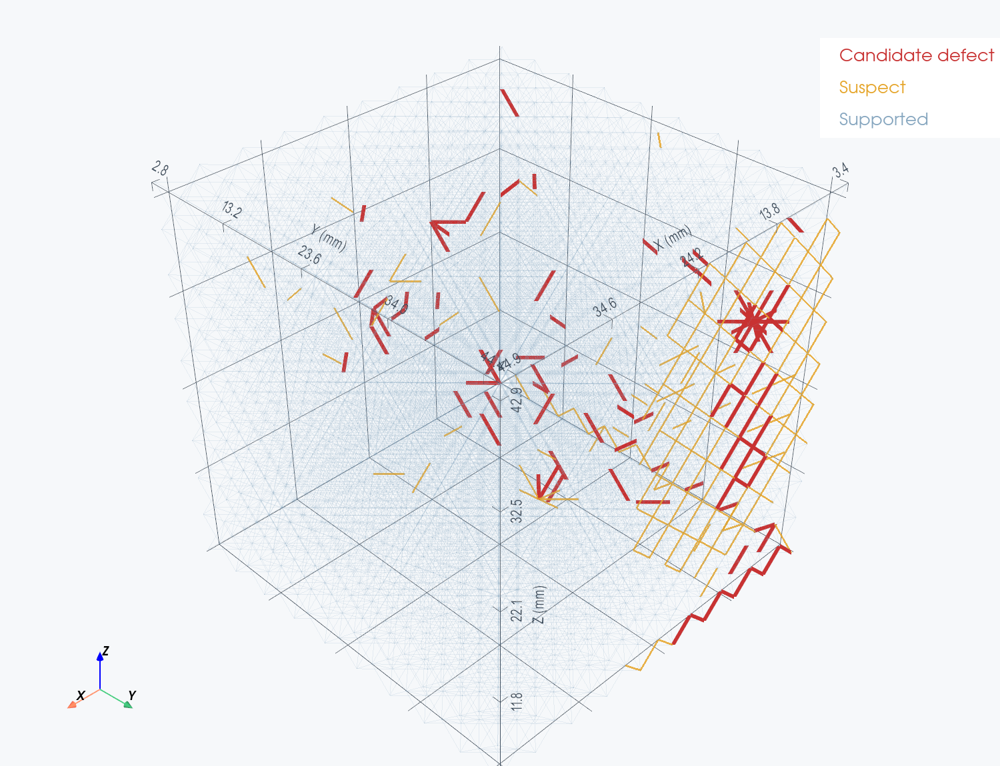
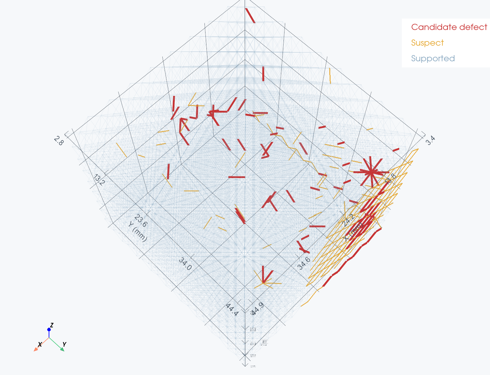
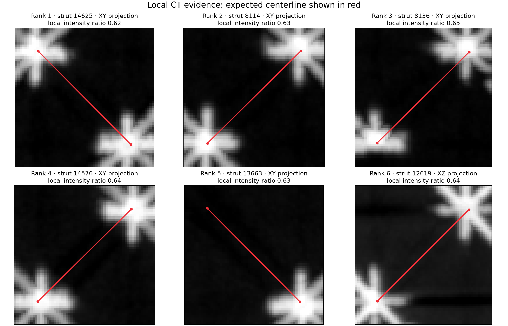

# Registered CT strut-defect screening

## Summary

| Metric | Value |
|---|---:|
| TIFF shape (Z × Y × X) | 761 × 815 × 837 |
| Voxel spacing | 58.09 µm isotropic |
| Expected JSON struts | 18,468 |
| Otsu material threshold | 40139.3 |
| Candidate defects | 92 |
| Suspects | 185 |
| Supported | 18,191 |

The red and yellow labels are **screening results, not ground truth**. The method searches for CT
material near each registered ideal centerline and normalizes each measurement against nearby
struts to reduce spatial CT intensity bias. Candidate defects are the weakest
0.50% of expected struts; suspects are the next weakest group.

## 3D views

## Local CT evidence

The red segment is the expected registered centerline. A dark or unsupported path is consistent
with a missing strut, while a bright continuous path argues against the candidate.

## Fifteen weakest expected struts

| Rank | Strut ID | Defect score | Intensity / local baseline | Minimum / mean profile |
|---:|---:|---:|---:|---:|
| 1 | 14625 | 0.308 | 0.615 | 0.963 |
| 2 | 8114 | 0.303 | 0.626 | 0.949 |
| 3 | 8136 | 0.296 | 0.646 | 0.910 |
| 4 | 14576 | 0.296 | 0.640 | 0.933 |
| 5 | 13663 | 0.294 | 0.630 | 0.972 |
| 6 | 12619 | 0.285 | 0.643 | 0.973 |
| 7 | 4101 | 0.284 | 0.647 | 0.960 |
| 8 | 8764 | 0.283 | 0.648 | 0.962 |
| 9 | 13857 | 0.282 | 0.654 | 0.944 |
| 10 | 14637 | 0.281 | 0.648 | 0.970 |
| 11 | 14210 | 0.281 | 0.654 | 0.953 |
| 12 | 13884 | 0.279 | 0.651 | 0.970 |
| 13 | 13061 | 0.279 | 0.652 | 0.965 |
| 14 | 12639 | 0.277 | 0.660 | 0.946 |
| 15 | 8823 | 0.277 | 0.666 | 0.926 |

## Interpretation and next validation

- Low intensity relative to nearby struts is consistent with a missing strut.
- A deep internal intensity drop is consistent with a broken or disconnected strut.
- Misregistration, CT artifacts, and centerline displacement can create false positives.
- Confirm candidates by inspecting local orthogonal CT slices or by comparing against a manually
  labeled subset. A learned model is not required until this baseline has been validated.
