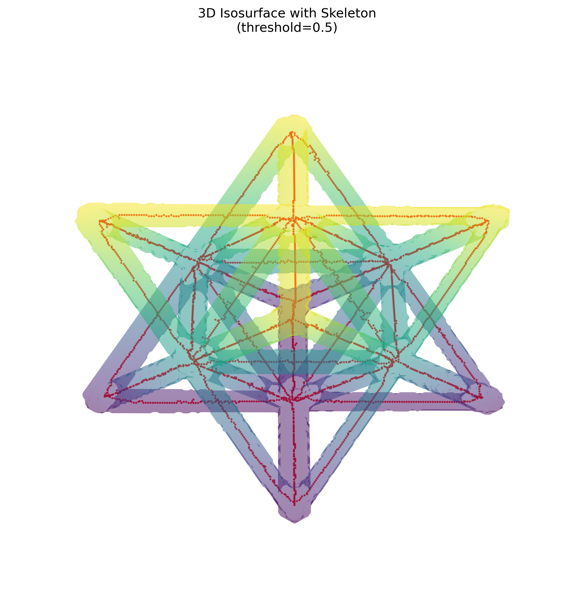
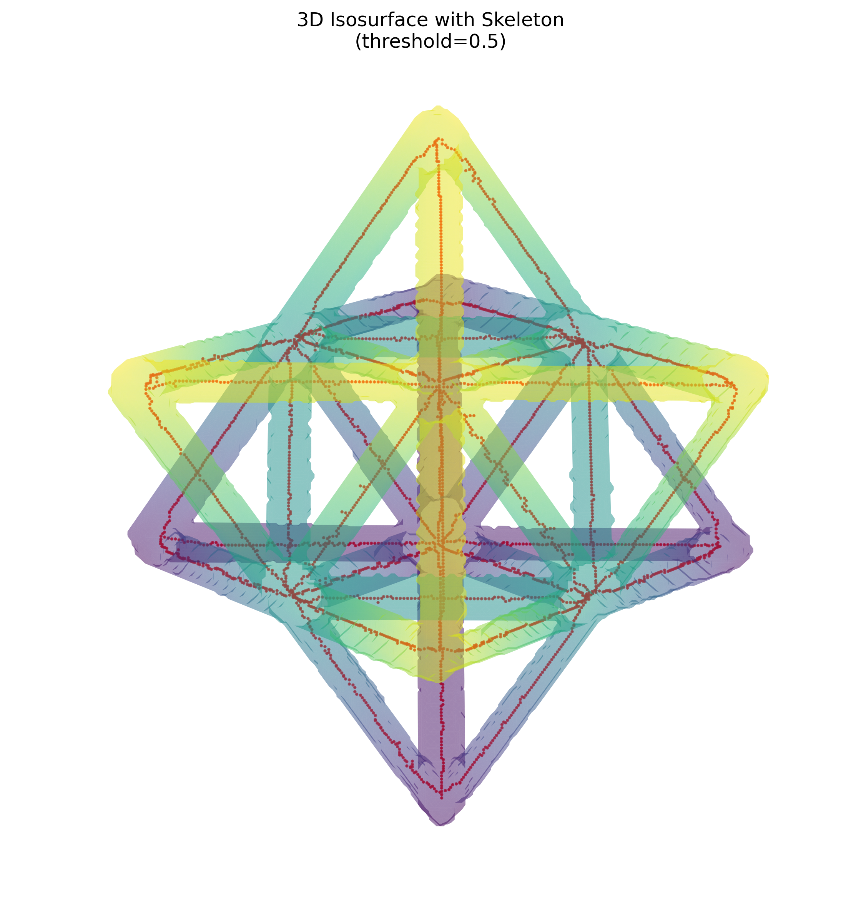

# NDE Report: Unit Cell CT Volume

## Dataset

| Artifact | File | Shape | Data type |
|---|---|---:|---|
| Original CT volume | `unitcell.npy` | 256 × 256 × 256 | `float32` |
| Segmented mask | `unitcell_mask.npy` | 256 × 256 × 256 | `uint8` |
| Skeleton | `unitcell_skeleton.npy` | 256 × 256 × 256 | `bool` |

All three arrays are shape-compatible. The mask was generated with an Otsu intensity threshold of **0.005813093856**.

## Summary metrics

| Source | Metric | Result |
|---|---|---:|
| Volume | Total voxel count | 16,777,216 |
| Volume | Global mean intensity | 0.0005390672 |
| Volume | Global intensity standard deviation | 0.0024182431 |
| Mask / ROI | Foreground voxel count | 717,852 |
| Mask / ROI | Foreground volume fraction | 4.2787% |
| Mask / ROI | Mean intensity inside ROI | 0.0116956588 |
| Background | Mean intensity outside ROI | 0.0000403684 |
| Skeleton | Skeleton voxel count (length proxy) | 3,182 |
| Skeleton | Skeleton-to-mask voxel ratio | 0.4433% |
| Skeleton | Connected components | 1 |
| Skeleton | Endpoint voxels | 39 |
| Skeleton | Branch-point voxels | 137 |
| Alignment | Skeleton voxels outside mask | 0 |

Endpoint and branch-point counts use 26-neighbor 3D connectivity. A skeleton voxel with one neighbor is counted as an endpoint; a voxel with more than two neighbors is counted as a branch-point voxel. Because adjacent voxels can describe one physical junction, the branch-point count is a complexity indicator rather than a count of unique junctions. Skeleton voxel count is a length proxy because physical voxel spacing was not supplied.

## Visual gallery

### View A — elevation 30°, azimuth 45°

### View B — elevation 60°, azimuth 45°

The translucent surface represents the segmented mask and the red points represent the extracted skeleton. Both views use a 0.5 mask isosurface and a two-voxel downsampling factor for rendering.

## Analysis

The segmentation isolates 4.28% of the scanned volume. Mean intensity inside the mask is approximately 290 times the mean background intensity, indicating strong intensity separation between the selected structure and surrounding voxels.

The skeleton forms one connected component and every skeleton voxel lies inside the segmented mask. This demonstrates internally consistent mask-to-skeleton alignment and preservation of the unit cell's principal strut network. The two perspectives show the skeleton following the centers of the diagonal, horizontal, and vertical members throughout the structure.

The 39 endpoint voxels and 137 branch-point voxels indicate a highly connected lattice. These topology counts should be treated as voxel-based screening metrics: junction clustering, diagonal adjacency, image noise, and skeletonization behavior can cause several branch-point voxels to represent a single physical node.

## NDE interpretation

No skeleton-to-mask leakage was detected, and the skeleton remains globally connected. At this resolution, those observations do not indicate a gross break in the extracted load-path network. This report does not establish dimensional tolerances, crack detection sensitivity, or physical defect acceptance because voxel spacing, calibration, reference geometry, and acceptance criteria were not provided.
