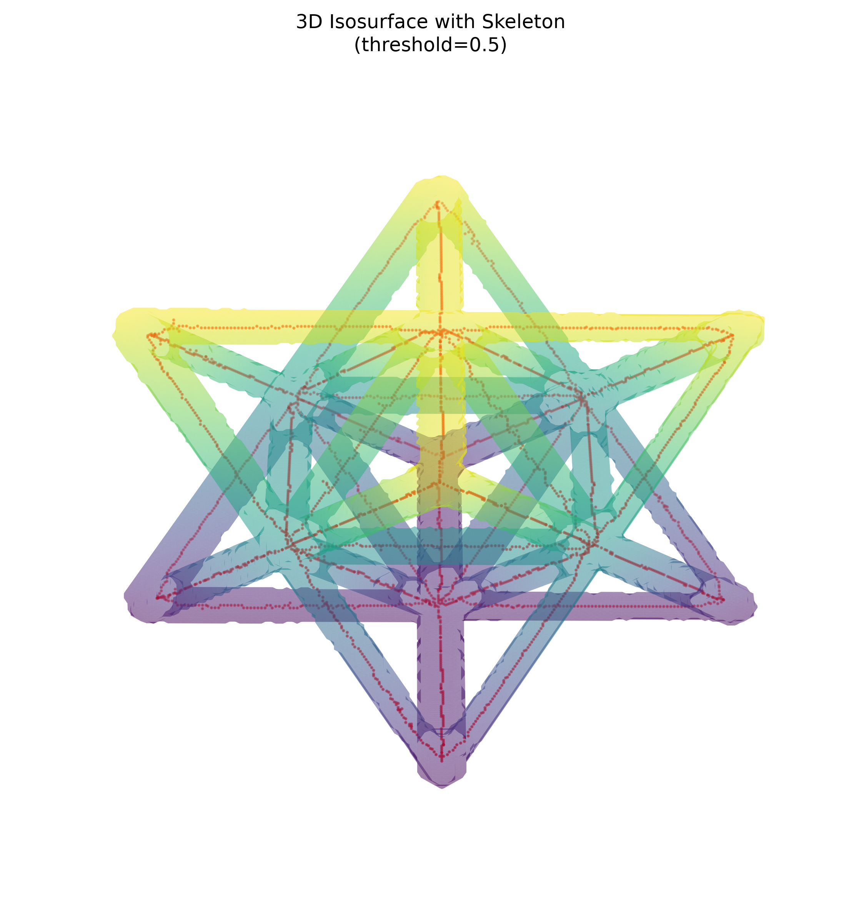
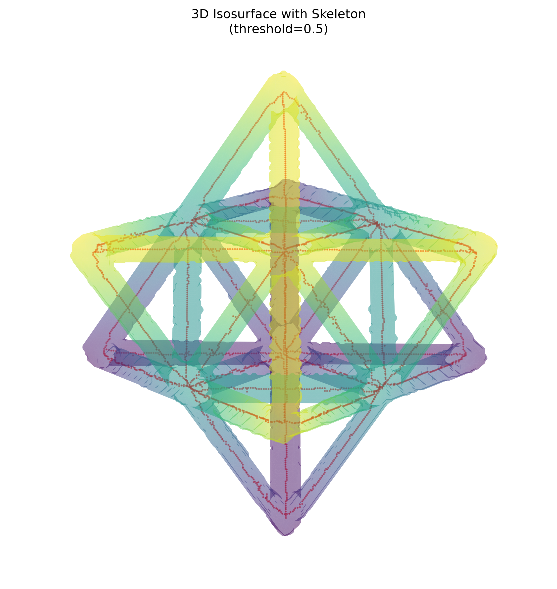

# NDE Report — Unit Cell

## Dataset and validation

The report uses the raw reconstruction (`unitcell.npy`), binary segmentation
(`unitcell_segmented.npy`), and skeleton (`unitcell_skeleton.npy`) in
`data/unitcell`.  All three arrays are shape-compatible at **256 × 256 × 256**
voxels.

## Summary metrics

| Source | Metric | Result |
|---|---|---:|
| Raw volume | Data type / extent | float32; 256 × 256 × 256 voxels |
| Raw volume | Intensity range | −0.003129 to 0.015258 |
| Raw volume | Global mean intensity | 0.000539 |
| Segmentation mask | Foreground volume | 721,774 voxels |
| Segmentation mask | Foreground fraction | 4.302% |
| Segmentation mask | Mean intensity within ROI | 0.011661 ± 0.001482 |
| Skeleton | Skeleton extent (voxel-path proxy) | 3,173 voxels |
| Skeleton | Connected components | 1 |
| Skeleton | Endpoints | 47 |
| Skeleton | Branch points | 168 |
| Skeleton | Mean node degree | 2.058 |
| Skeleton | Maximum node degree | 8 |

Skeleton degrees use a 26-neighbour voxel connectivity. Physical lengths cannot
be reported because voxel spacing was not supplied; the skeleton-voxel count is
therefore provided as a length proxy.

## 3D visual gallery

The mask is rendered as a semi-transparent isosurface and the skeleton is shown
in red. Renderings use a binary-mask isovalue of 0.5 after 2× downsampling.

### View A — elevation 30°, azimuth 45°

### View B — elevation 60°, azimuth 45°

## Interpretation

The ROI is a sparse, high-intensity structural network: its mean intensity is
about 21.6× the full-volume mean. The skeleton is a single connected network,
and **100% (3,173 / 3,173)** of skeleton voxels lie within the segmented mask.
In both views, the red centerlines follow the struts and nodes of the rendered
mask, indicating strong mask-to-skeleton alignment. The numerous endpoints and
branch points are consistent with a finite lattice unit cell, where members
terminate at the cropped cell boundary and meet at internal junctions.
